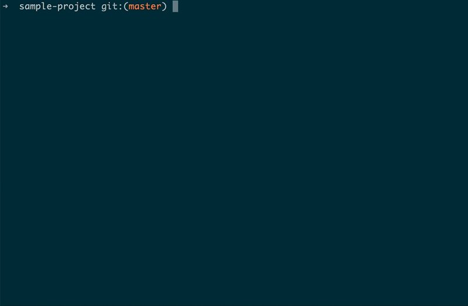

# Prettier Schematic

This schematic will add Prettier, Husky and lint-staged to your Angular project, and configure a pre-commit hook that will format your project files.

[](https://www.npmjs.com/package/@ricmello/prettier)

## Usage 🚀

```shell
ng add @ricmello/prettier
```

- install [Prettier](https://prettier.io), [Husky](https://typicode.github.io/husky/) and [lint-staged](https://github.com/okonet/lint-staged)
- creates a pre-commit hook that format the staged files


### Optionally: install globally

```shell
npm install -g @ricmello/prettier
```

Then in an Angular CLI project run

```shell
ng g @ricmello/prettier:add
```



